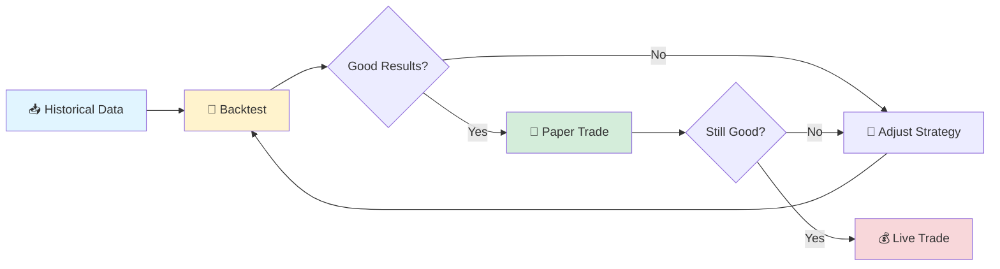

# TWS Robot - Your Automated Trading Assistant

**Test trading strategies, automate execution, manage risk — all from your browser.**

Transform your trading ideas into automated strategies. Test them on historical data, validate with paper trading, then deploy them live. TWS Robot's **web dashboard** handles the execution, risk management, and monitoring so you can focus on strategy — no terminal experience required.

---

## 🎯 What Can TWS Robot Do For You?

### For New Algorithmic Traders
- 🌐 **Web dashboard** - Point-and-click interface for managing everything from your browser
- 📚 **Learn by doing** - Run pre-built strategies and see how they work
- 🧪 **Test without risk** - Backtest on historical data before risking real money
- 🎓 **Start simple** - Interactive guides walk you through your first strategy
- 🛡️ **Built-in safety** - Risk management prevents catastrophic losses

### For Active Traders
- 🤖 **Automate execution** - Let the bot execute your strategy 24/7
- 📊 **Multiple strategies** - Run Moving Average, Mean Reversion, Momentum simultaneously
- ⚡ **Paper trading** - Validate strategies with real-time data before going live
- 📈 **Performance tracking** - See what's working with Sharpe ratio, win rate, drawdown

### For Quantitative Developers
- 🏗️ **Professional architecture** - Event-driven design, modular components
- 🧬 **Extensible framework** - Build custom strategies on proven infrastructure
- 📊 **Advanced analytics** - Comprehensive backtesting with realistic market simulation (Moving Average, Mean Reversion, Momentum templates included)
- 🔧 **Full control** - Customize risk profiles, position sizing, and execution logic
- 🤖 **Live trading ready** - Bollinger Bands strategy available for paper/live trading

---

## ⚡ Quick Start (5 Minutes)

> **Prerequisites:** For **paper or live trading**, you need [Interactive Brokers TWS](https://www.interactivebrokers.com/en/trading/tws.php) (or IB Gateway) running with API access enabled. Backtesting works without TWS. See the **[TWS Connection Guide](docs/TWS_CONNECTION_GUIDE.md)** for complete setup instructions.

### 1. Install TWS Robot

```bash
# Clone and set up
git clone https://github.com/evanlow/tws_robot.git
cd tws_robot

# Create virtual environment
python -m venv venv

# Activate it (choose your platform)
.\venv\Scripts\Activate.ps1  # Windows PowerShell
source venv/bin/activate        # Mac/Linux

# Install dependencies
pip install -r requirements.txt
```

### 2. Launch the Web Dashboard (Recommended)

The easiest way to use TWS Robot is through the **web dashboard** — no terminal expertise needed:

```bash
# Start the web dashboard
python scripts/run_web.py

# Then open your browser to: http://127.0.0.1:5000
```

From the dashboard you can:
- 📊 **View positions and P&L** on the Dashboard page
- 🧪 **Run backtests** from the Backtest page
- 🤖 **Manage strategies** on the Strategies page
- 🛡️ **Monitor risk** on the Risk page
- ⚙️ **Configure settings** on the Settings page
- 🚨 **Emergency stop** with one click from the top bar

### 3. Or Use the Command Line

If you prefer working in a terminal:

**New to algo trading? Start here:**
```bash
# Interactive guide to choose a strategy for your stock
python scripts/strategy_selector.py
```

**Want to see if a strategy works? Try this:**
```bash
# Test Moving Average strategy on historical data
python scripts/quick_start.py
```

> 💡 **Note:** Quick start examples use **backtest strategies** (Moving Average, Mean Reversion, Momentum) for historical testing. For **live/paper trading**, see the Bollinger Bands strategy in `strategies/` folder.

**Ready to explore? Check these out:**
```bash
# Compare Conservative vs. Aggressive risk profiles
python examples/example_profile_comparison.py

# Test all three strategies (MA, Mean Reversion, Momentum)
python examples/example_strategy_templates.py
```

### 3. Understand the Workflow



**Never skip steps!** Every successful strategy follows this path.

### 4. Learn More

📖 **[Read the User Guide](docs/USER_GUIDE.md)** - Everything you need to know to use TWS Robot effectively
- Understand what each strategy does and when to use it
- Learn about risk management and position sizing
- Get a realistic weekly trading routine
- Know when to stop trading a strategy

---

## 📁 Project Structure

Understanding the codebase:

```
tws_robot/
├── web/                   # ⭐ Web dashboard (primary user interface)
│   ├── routes/               # One Blueprint per menu section
│   ├── templates/            # Jinja2 HTML templates
│   └── static/               # CSS, JavaScript assets
├── backtest/              # Historical testing engine
│   ├── strategy_templates.py  # Pre-built strategies (MA, MeanReversion, Momentum)
│   ├── engine.py             # Backtesting engine
│   ├── data_manager.py       # Historical data handling
│   └── profiles.py           # Risk profiles (Conservative, Moderate, Aggressive)
├── strategies/            # Live trading strategies
│   └── bollinger_bands.py    # Production-ready Bollinger Bands strategy
├── risk/                  # Risk management system
│   ├── risk_manager.py       # Position sizing, drawdown control
│   └── position_sizer.py     # Calculate position sizes
├── core/                  # Infrastructure
│   ├── event_bus.py          # Event-driven architecture
│   └── ...                   # Other core components
├── execution/             # Order execution and TWS integration
├── monitoring/            # Performance tracking
├── scripts/               # Command-line utilities (run_web.py, quick_start.py, etc.)
├── examples/              # Self-contained demonstration scripts
└── docs/                  # Documentation
```

**🎯 Quick Navigation:**
- **Want to use the dashboard?** → `python scripts/run_web.py` then open http://127.0.0.1:5000
- **Want to backtest?** → `backtest/strategy_templates.py`
- **Want to live trade?** → `strategies/bollinger_bands.py`
- **Need risk controls?** → `risk/risk_manager.py`
- **Building custom strategy?** → `docs/runbooks/adding-new-strategy.md`

---

## ❓ Frequently Asked Questions

### Can I use this for live trading right now?
Yes, but limited. The **BollingerBands strategy** is production-ready for paper/live trading. Other strategies (Moving Average, Mean Reversion, Momentum) are backtest-only currently.

### Which strategy should I start with?
1. **New to algo trading?** Start with `python scripts/strategy_selector.py` for guided selection
2. **Want proven results?** Backtest all strategies: `python examples/example_strategy_templates.py`
3. **Ready to trade?** Use BollingerBands with conservative risk profile

### Do I need Interactive Brokers TWS running?
- **For backtesting:** No, works offline with historical data
- **For paper trading:** Yes, need TWS Paper Trading mode (port 7497)
- **For live trading:** Yes, need TWS with live account (port 7496)
- **Setup guide:** See the **[TWS Connection Guide](docs/TWS_CONNECTION_GUIDE.md)** for step-by-step instructions

### How much capital do I need?
- **Backtesting:** $0 (simulated)
- **Paper trading:** $0 (simulated TWS account)
- **Live trading:** Minimum $10,000 recommended for proper diversification

### Is this beginner-friendly?
**Absolutely!** TWS Robot includes a **web dashboard** that you can access in your browser — no terminal experience required.  
**Backtesting:** Yes! The web dashboard lets you run backtests with a few clicks  
**Live trading:** Intermediate+ (requires understanding of trading, risk management, TWS setup)

### What if I get errors?
1. Check you're in the project directory and venv is activated
2. Verify dependencies installed: `pip install -r requirements.txt`
3. For TWS connection issues, see [Troubleshooting](#-troubleshooting) below
4. See [Debugging Guide](docs/runbooks/debugging-strategies.md) for detailed help

---

## 🔧 Troubleshooting

### "ModuleNotFoundError: No module named 'backtest'"
```bash
# Ensure you're in the project directory
cd tws_robot

# Activate virtual environment
.\venv\Scripts\Activate.ps1  # Windows
source venv/bin/activate      # Mac/Linux

# Install dependencies
pip install -r requirements.txt
```

### "Connection refused" when running check_account.py
- Ensure TWS or IB Gateway is running
- Check TWS API settings enabled: **Edit → Global Configuration → API → Settings**
  - Enable ActiveX and Socket Clients
  - Trusted IP addresses: 127.0.0.1
- Paper trading uses port **7497**, live uses port **7496**

### "No data available" during backtest
```bash
# Download historical data first
python scripts/download_real_data.py AAPL MSFT GOOGL
```

### Tests failing
```bash
# Clear test cache and rerun
pytest --cache-clear

# Run specific test file
pytest test_backtest_engine.py -v
```

**More help:**
- [Debugging Strategies Guide](docs/runbooks/debugging-strategies.md)
- [Emergency Procedures](docs/runbooks/emergency-procedures.md)
- [Architecture Documentation](docs/architecture/overview.md)

---

## 📚 Documentation Index

**Getting Started:**
- ⭐ **[Your First 30 Minutes](docs/GETTING_STARTED_30MIN.md) - Complete beginner tutorial**
- [README](README.md) - Quick start and overview (you are here)
- [User Guide](docs/USER_GUIDE.md) - Learn strategies and workflows
- [Examples Guide](docs/EXAMPLES_GUIDE.md) - Working code examples
- [Quick Reference](docs/QUICK_REFERENCE.md) - Commands and configs cheat sheet

**Development:**
- [API Reference](docs/API_REFERENCE.md) - Complete developer API documentation
- [Contributing Guide](docs/CONTRIBUTING.md) - How to contribute
- [Technical Specs](docs/TECHNICAL_SPECS.md) - Architecture details
- [Architecture Docs](docs/architecture/overview.md) - System design
- [Adding New Strategy](docs/runbooks/adding-new-strategy.md) - Development guide
- [Prime Directive](prime_directive.md) - Development philosophy

**Operations:**
- [Deployment Guide](docs/DEPLOYMENT_GUIDE.md) - Production setup
- [Local Deployment](docs/LOCAL_DEPLOYMENT.md) - Local development setup
- [Emergency Procedures](docs/runbooks/emergency-procedures.md) - Crisis management
- [Debugging Guide](docs/runbooks/debugging-strategies.md) - Troubleshooting

---
## 📊 Performance Benchmarks

**Test Environment:** Windows 11, Python 3.12.10, 690 tests passing

### Strategy Backtest Performance (2022-2023)

| Strategy | Symbol | Total Return | Sharpe Ratio | Max Drawdown | Win Rate |
|----------|--------|--------------|--------------|--------------|----------|
| Moving Average | AAPL | +18.7% | 1.52 | -8.1% | 56.7% |
| Mean Reversion | KO | +12.3% | 1.38 | -6.5% | 62.1% |
| Momentum | NVDA | +31.2% | 1.71 | -12.3% | 51.3% |

**Benchmark:** S&P 500 buy-and-hold returned +15.2% over same period.

### System Performance

- **Backtest Speed:** 2 years of daily data processed in ~8 seconds
- **Data Processing:** 500+ bars/second
- **Test Suite:** All 690 tests complete in ~45 seconds
- **Memory Usage:** ~500MB for typical backtest
- **Order Execution:** < 100ms latency to TWS (paper/live)

### Risk Management

- **Position Sizing:** Dynamic based on volatility and account equity
- **Risk Per Trade:** 1-2% of account by default
- **Correlation Analysis:** Multi-asset portfolio risk checking
- **Emergency Stop:** Automatic portfolio halt at -5% daily loss

*Note: Past performance does not guarantee future results. All figures are from backtests on historical data.*

---
## 🎓 What You'll Learn

### Module 1: Your First Strategy
- Run a backtest and interpret results
- Understand Sharpe ratio, drawdown, win rate
- Test strategies on different stocks
- Choose a risk profile (Conservative/Balanced/Aggressive)

### Module 2: Paper Trading
- Connect to Interactive Brokers paper account
- Run strategies with real-time data (fake money)
- Monitor performance daily
- Learn when a strategy stops working

### Module 3: Risk Management
- Set position sizes based on account size
- Implement stop losses and take profits
- Use circuit breakers to prevent disasters
- Build a diversified strategy portfolio

### Module 4: Go Live (If Ready)
- Start with small position sizes
- Monitor daily for first month
- Track performance vs. expectations
- Adjust or stop strategies as needed

**Full learning path in [USER_GUIDE.md](docs/USER_GUIDE.md)**

---

## 🏆 Built-In Strategies

| Strategy | Best For | When to Use | Example Stocks |
|----------|----------|-------------|----------------|
| **Moving Average Crossover** | Trending markets | Stock has clear up/down movements | AAPL, MSFT, NVDA |
| **Mean Reversion** | Range-bound markets | Stock bounces around stable average | KO, PG, JNJ |
| **Momentum** | High-growth stocks | Stock shows strong trends | TSLA, growth stocks |

**Not sure which to use?** Run `python scripts/strategy_selector.py` for personalized recommendations.

---

## 🛡️ Safety & Risk Management

### Built-In Protections
- ✅ **Paper trading first** - Test with fake money before risking real capital
- ✅ **Position limits** - Never risk more than configured percentage per trade
- ✅ **Circuit breakers** - Auto-shutdown on excessive losses (2% daily, 15% total)
- ✅ **Market hours checks** - Warns about after-hours trading
- ✅ **Confirmation prompts** - Extra confirmation for live trading

### Risk Profiles

Choose your comfort level:
- **Conservative** - 2-3% per trade, tight stops, retirement accounts
- **Balanced** - 5% per trade, moderate stops, active traders  
- **Aggressive** - 10% per trade, wide stops, experienced traders

---

## 🔧 Advanced Features

**Professional-grade backtesting:**
- Realistic market simulation with slippage and commissions
- Performance analytics (Sharpe, Sortino, Calmar ratios)
- Trade-by-trade analysis and visualization
- Parameter optimization tools

**Multi-strategy execution:**
- Run multiple strategies simultaneously
- Portfolio-level risk management
- Strategy comparison and correlation analysis
- Automated performance reporting

**Web dashboard (built-in):**
- Real-time position and P&L tracking
- Strategy management and monitoring
- Backtest execution from the browser
- Risk monitoring and emergency stop
- Logs viewer and settings configuration
- AI-powered strategy assistant

---

## 📚 Documentation & Guides

**Start Here:** Your complete guide to TWS Robot documentation.

### 🎯 For New Users - Start Here

| Guide | When to Use | What You'll Learn |
|-------|-------------|-------------------|
| **[Web Dashboard](scripts/run_web.py)** | Right now! | Launch `python scripts/run_web.py` and open http://127.0.0.1:5000 |
| **[USER_GUIDE.md](docs/USER_GUIDE.md)** | Your first 30 minutes | Complete walkthrough: strategies, risk management, weekly routine, realistic expectations |
| **[QUICK_REFERENCE.md](docs/QUICK_REFERENCE.md)** | Daily commands | Cheat sheet: common commands, quick metrics guide, emergency procedures |
| **[Quick Start Script](scripts/quick_start.py)** | From the terminal | Run your first backtest in 5 minutes |

### 📖 Understanding What You Have

| Guide | When to Use | What You'll Learn |
|-------|-------------|-------------------|
| **[EXAMPLES_GUIDE.md](docs/EXAMPLES_GUIDE.md)** | Before running any example | What each example script does, expected output, common issues |
| **[PROJECT_PLAN.md](docs/PROJECT_PLAN.md)** | Understanding architecture | System design, component overview, development guidelines |

### 🔧 For Active Trading

| Guide | When to Use | What You'll Learn |
|-------|-------------|-------------------|
| **[Web Dashboard](/)**  | Every trading session | Real-time positions, P&L, strategy status, risk monitoring |
| **[check_account.py](scripts/check_account.py)** | Terminal account check | Current account status, positions, P&L, margin health |
| **[market_status.py](scripts/market_status.py)** | Before placing trades | Is the market open? Safe to trade? |
| **[Strategy Selector](scripts/strategy_selector.py)** | Choosing a strategy | Interactive tool: finds best strategy for your stock |

### 🚀 For Developers

| Guide | When to Use | What You'll Learn |
|-------|-------------|-------------------|
| **[prime_directive.md](prime_directive.md)** | Before coding anything | Development standards, testing requirements, code quality rules |
| **[TECHNICAL_SPECS.md](docs/TECHNICAL_SPECS.md)** | Building features | API references, class structures, integration patterns |
| **[docs/](docs/)** | Deep dives | Architecture details, runbooks, troubleshooting guides |

### 📊 Understanding Results

| Guide | When to Use | What You'll Learn |
|-------|-------------|-------------------|
| **[Metrics in USER_GUIDE](docs/USER_GUIDE.md#understanding-your-results)** | After every backtest | What Sharpe ratio, drawdown, win rate mean |
| **[Risk Management in USER_GUIDE](docs/USER_GUIDE.md#risk-management)** | Setting up strategies | Position sizing, stop losses, circuit breakers |

### 🆘 When Things Go Wrong

| Guide | When to Use | What You'll Find |
|-------|-------------|------------------|
| **[QUICK_REFERENCE.md](docs/QUICK_REFERENCE.md#troubleshooting)** | Quick fixes | Common errors and fast solutions |
| **[Emergency Procedures](docs/QUICK_REFERENCE.md#emergency-commands)** | System acting weird | How to stop everything NOW |
| **[docs/runbooks/debugging-strategies.md](docs/runbooks/debugging-strategies.md)** | Strategy not working | Step-by-step debugging process |

### 📚 Documentation Reading Order

**If you're brand new:**
1. **This README** (you are here!) → Get the big picture
2. **[USER_GUIDE.md](docs/USER_GUIDE.md)** → Learn strategies and risk management
3. **[QUICK_REFERENCE.md](docs/QUICK_REFERENCE.md)** → Bookmark for daily use
4. **[EXAMPLES_GUIDE.md](docs/EXAMPLES_GUIDE.md)** → Before running examples

**If you want to trade today:**
1. **[Web Dashboard](scripts/run_web.py)** → Run `python scripts/run_web.py` and open http://127.0.0.1:5000
2. **[Strategy Selector](scripts/strategy_selector.py)** → Pick your strategy
3. **[check_account.py](scripts/check_account.py)** → Check account status
4. **[QUICK_REFERENCE.md](docs/QUICK_REFERENCE.md)** → Commands you need

**If you're a developer:**
1. **[prime_directive.md](prime_directive.md)** → MUST READ before coding
2. **[PROJECT_PLAN.md](docs/PROJECT_PLAN.md)** → Understand architecture
3. **[TECHNICAL_SPECS.md](docs/TECHNICAL_SPECS.md)** → API references
4. **[docs/](docs/)** → Deep technical docs

---

## 🚨 Critical Information

### Realistic Expectations
- ✅ Good strategy: 10-20% annual return
- ✅ Great strategy: 20-30% annual return  
- ❌ Claiming 50%+: Probably too risky or unrealistic

**Remember:** S&P 500 averages ~10% per year. Beating that consistently is success!

### The Golden Rules
1. **ALWAYS backtest first** - If it didn't work historically, it won't work now
2. **ALWAYS paper trade 30+ days** - Prove it works in real-time
3. **NEVER risk more than 1-2% per trade** - Survive being wrong 20+ times
4. **NEVER set-and-forget** - Check your system daily
5. **STOP if strategy fails** - 5+ consecutive losses or 10% drawdown = stop and reassess

---

## 🔧 Environment-Based Configuration

**Web dashboard for easy management:**
- Launch with `python scripts/run_web.py` and access at http://127.0.0.1:5000
- Manage strategies, run backtests, and monitor risk from your browser
- Connect/disconnect from TWS directly via the Settings page
- Emergency stop button always visible in the top bar

**Supports both paper and live trading:**
- Configuration via `.env` files for security
- Easy switching between environments
- Separate settings for paper/live accounts

**Market Status Integration:**
- Real-time US stock market status checking
- Automatic warnings for after-hours trading
- Safety prompts for live trading during market closures

**TWS Integration:**
- Real-time market data streaming
- Historical data collection
- Account balance and portfolio monitoring
- Order execution capabilities

---

## 🚀 Installation & Setup

### Prerequisites

1. **Interactive Brokers Account** - Paper or live trading account (only needed for paper/live trading, not for backtesting)
2. **TWS or IB Gateway** - Download from Interactive Brokers website (only needed for paper/live trading)
3. **Python 3.8+** - With pip package manager

### Step-by-Step Installation

**1. Clone the repository:**
```bash
git clone https://github.com/evanlow/tws_robot.git
cd tws_robot
```

**2. Create virtual environment:**
```bash
python -m venv venv
```

**3. Activate virtual environment:**
```bash
# Windows PowerShell
.\venv\Scripts\Activate.ps1

# macOS/Linux
source venv/bin/activate
```

**4. Install dependencies:**
```bash
pip install -r requirements.txt
```

**5. Configure your account:**
```bash
cp .env.example .env
# Edit .env with your Interactive Brokers details
```

### Interactive Brokers Setup

**Enable API Access in TWS:**
1. Open TWS or IB Gateway
2. Go to: File → Global Configuration → API → Settings
3. Enable "Enable ActiveX and Socket Clients"
4. Set Socket Port:
   - Paper trading: `7497`
   - Live trading: `7496`
5. Add `127.0.0.1` to trusted IPs if prompted

---

## 🎮 Usage Examples

### Web Dashboard (Easiest — Recommended for Most Users)

```bash
# Start the web dashboard
python scripts/run_web.py

# Open in your browser: http://127.0.0.1:5000
# Optional: specify host/port
python scripts/run_web.py --host 0.0.0.0 --port 8080 --debug
```

From the web dashboard you can manage everything visually:
- **Dashboard** — Connection status, equity, P&L, active strategies at a glance
- **Strategies** — Start, stop, and monitor your trading strategies
- **Backtest** — Run backtests and review results
- **Positions** — View open positions and trade history
- **Risk** — Monitor risk levels and circuit breaker status
- **Logs** — Browse application logs in real time
- **Settings** — Configure TWS connection and trading parameters

### Command-Line Backtesting

```bash
# Interactive guide for first-time users
python scripts/quick_start.py

# Find the right strategy for your stock
python scripts/strategy_selector.py

# Compare risk profiles (Conservative vs. Aggressive)
python examples/example_profile_comparison.py

# Test all three strategies on historical data
python examples/example_strategy_templates.py
```

### Paper Trading (Recommended Before Live)

```bash
# Start paper trading with default settings
python tws_client.py --env paper --timeout 30

# Show current configuration
python tws_client.py --show-config

# Skip market status check (for after-hours testing)
python tws_client.py --env paper --skip-market-check
```

### Live Trading (Use With Caution!)

```bash
# Live trading requires explicit confirmation
python tws_client.py --env live --timeout 60

# Check market status before trading
python scripts/market_status.py
```

### Command Line Options

| Option | Description |
|--------|-------------|
| `--env, -e` | Trading environment: `paper` or `live` |
| `--timeout, -t` | Set timeout in seconds (default: no timeout) |
| `--show-config` | Display current configuration and exit |
| `--skip-market-check` | Skip market status verification |
| `--no-timeout` | Run without timeout |
| `--help, -h` | Show help message |

---

## 📊 Understanding Your Results

### Key Metrics Explained

**Total Return**
- Your profit/loss percentage over the test period
- Compare to S&P 500 (~10% annually) as benchmark

**Sharpe Ratio** (Risk-adjusted return)
- `> 2.0` = Excellent  
- `> 1.0` = Good
- `> 0.5` = Fair
- `< 0.5` = Poor (too much risk)

**Max Drawdown** (Worst loss from peak)
- `< 10%` = Low risk
- `10-20%` = Moderate risk
- `> 20%` = High risk (be careful!)

**Win Rate** (Percentage of winning trades)
- `> 60%` = Great
- `> 50%` = Good (more wins than losses)
- `< 40%` = Concerning (review strategy)

---

## Project Structure

```
tws_robot/
├── web/                 # ⭐ Flask web UI (primary user interface)
│   ├── app.py           #   Application entry point
│   ├── routes/          #   One Blueprint per menu section
│   ├── templates/       #   Jinja2 HTML templates
│   └── static/          #   CSS, JavaScript assets
├── backtest/            # Backtesting engine, data manager, analytics, profiles
├── config/              # Environment & broker configuration
│   ├── env_config.py    #   Loads & validates .env at runtime
│   ├── paper.py         #   Paper trading defaults (port 7497)
│   └── live.py          #   Live trading defaults (port 7496)
├── core/                # Event bus, TWS connection, order management
├── data/                # SQLite databases, data models, real-time pipeline
├── deployment_scripts/  # Startup / backup scripts
├── docs/                # All project documentation
│   ├── architecture/    #   System design overviews
│   ├── decisions/       #   Architectural decision records (ADRs)
│   ├── runbooks/        #   Operational runbooks
│   └── sprints/         #   Sprint & week-by-week progress logs
├── examples/            # Self-contained demonstration scripts
├── execution/           # Order executor, market data feed, paper adapter
├── ibapi/               # Interactive Brokers Python API (vendored)
├── monitoring/          # Paper trading monitor, validation monitor
├── reports/             # Generated backtest chart images
├── risk/                # Risk manager, position sizer, drawdown control
├── scripts/             # Command-line utilities and entry points
│   ├── run_web.py       #   Start the Flask web UI
│   ├── quick_start.py   #   Your first backtest (5 min)
│   ├── run_live.py      #   Launch paper / live trading session
│   ├── check_account.py #   Account balance, positions, P&L
│   ├── market_status.py #   Is the US market open?
│   └── ...
├── strategies/          # Live-trading strategies (Bollinger Bands), configs
├── strategy/            # Strategy lifecycle, metrics, promotion, validation
├── tests/               # Full test suite (mirrors source structure)
├── .env.example         # Configuration template
├── prime_directive.md   # Development standards & safety rules
├── pytest.ini           # Test discovery & coverage config
├── requirements.txt     # Python dependencies
├── README.md            # This file
└── tws_robot_spec.md    # Full application specification
```

## Safety & Security

⚠️ **Important Security Notes**:

- **Never commit `.env` file** - Contains sensitive account information
- **Use paper trading first** - Test strategies before going live
- **Monitor live trades** - Always supervise automated trading
- **Market hours awareness** - System warns about after-hours trading

## TWS Setup

1. **Start TWS or IB Gateway**
2. **Enable API connections**:
   - File → Global Configuration → API → Settings
   - Enable "Enable ActiveX and Socket Clients"
   - Set Socket Port: 7497 (paper) or 7496 (live)
3. **Add trusted IPs**: Add `127.0.0.1` if needed

## Error Codes

Common TWS error codes you might see:

- **2104**: Market data farm connection OK (informational)
- **2106**: HMDS data farm connection OK (informational)  
- **2158**: Security definition data farm connection OK (informational)
- **2108**: Unable to subscribe to market data (normal during off-hours)

## Contributing

1. Fork the repository
2. Create a feature branch (`git checkout -b feature/amazing-feature`)
3. Commit your changes (`git commit -m 'Add amazing feature'`)
4. Push to the branch (`git push origin feature/amazing-feature`)
5. Open a Pull Request

## License

This project is for educational purposes only. Please ensure you understand the risks of automated trading and comply with all applicable regulations.

## Disclaimer

**⚠️ Trading Risk Warning**: 
- Automated trading involves substantial risk of loss
- Past performance does not guarantee future results
- Only trade with money you can afford to lose
- Always test strategies in paper trading first
- Monitor your automated systems at all times

The authors are not responsible for any financial losses incurred through the use of this software.

## 🆘 Getting Help

### Common Questions

**"How much money can I make?"**
- Realistic: 10-30% annually with good strategies
- Anything claiming 50%+ is likely too risky
- Goal: Beat S&P 500's ~10% average consistently

**"Which strategy should I use?"**
- Start with Moving Average Crossover (simplest)
- Run `python scripts/strategy_selector.py` for personalized recommendations
- Test multiple strategies to find what works for you

**"How much money do I need?"**
- Paper trading: $0 (fake money)
- Live trading: $5,000-$10,000 minimum recommended
- Need enough to diversify and cover commissions

**"What if my strategy stops working?"**
- Normal! Markets change and strategies fail
- Stop trading if: 2 months of losses, 10% drawdown, or 5+ consecutive losses
- Re-test on recent data and adjust or switch strategies

### Support Resources

📖 **Read First:**
- [USER_GUIDE.md](docs/USER_GUIDE.md) - Complete trader's guide
- [Technical Docs](docs/) - Architecture and API reference
- [Runbooks](docs/runbooks/) - Common tasks and troubleshooting

🐛 **Found a Bug?**
1. Check existing [Issues](https://github.com/evanlow/tws_robot/issues)
2. Create new issue with:
   - What you were trying to do
   - What happened vs. what you expected
   - Error messages and logs
   - Your configuration (hide sensitive data!)

💡 **Have a Suggestion?**
We love feature requests! Open an issue with the "enhancement" label.

---

## 🎯 Your TWS Robot Journey

### Module 1: Learn & Test
- [ ] Launch the web dashboard: `python scripts/run_web.py`
- [ ] Run `python scripts/quick_start.py` for your first backtest
- [ ] Test strategies with `python examples/example_strategy_templates.py`
- [ ] Use `python scripts/strategy_selector.py` to find your strategy
- [ ] Read [USER_GUIDE.md](docs/USER_GUIDE.md) completely

### Module 2: Paper Trade
- [ ] Connect to IB paper account
- [ ] Run chosen strategy for 30 days minimum
- [ ] Track daily performance
- [ ] Verify risk controls work correctly

### Module 3: Evaluate Results
- [ ] Did you beat buy-and-hold?
- [ ] Is Sharpe ratio > 1.0?
- [ ] Is max drawdown acceptable?
- [ ] Ready to go live? Start small!

### Going Live (If Ready)
- [ ] Start with 25% of intended capital
- [ ] Use 1% position sizes initially
- [ ] Monitor daily for first month
- [ ] Scale up gradually if successful

**Remember:** Most traders fail. Go slow, test thoroughly, and never risk money you can't afford to lose.

---

**Happy Trading! 📈**