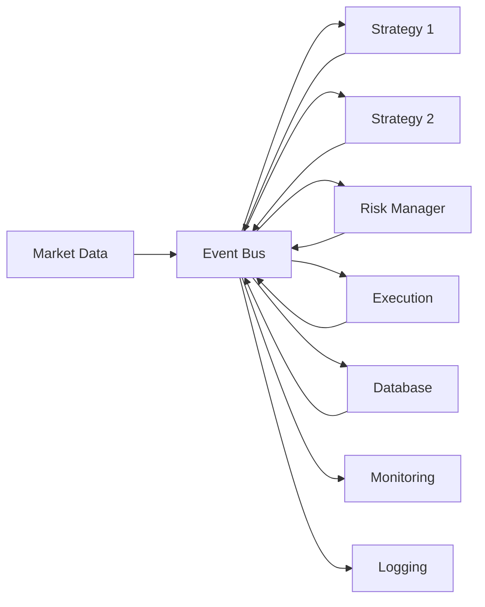
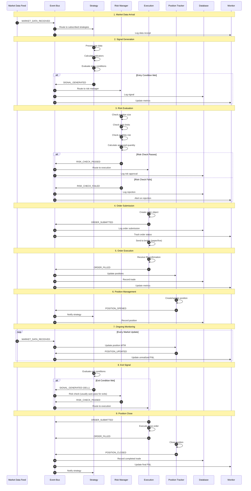

# Event Flow & Communication

## Overview

The TWS Robot uses an **event-driven architecture** where all components communicate through a central Event Bus. This design provides:
- **Loose coupling** - Components don't need to know about each other
- **Testability** - Easy to mock and test in isolation
- **Flexibility** - Add new components without modifying existing ones
- **Observability** - All system activity flows through observable events

## Event Bus Architecture



**Key Concept:** Components publish events without knowing who (if anyone) is listening. Subscribers receive events without knowing who published them.

## Event Types

### Market Data Events

**MARKET_DATA_RECEIVED**
```python
{
    'event_type': EventType.MARKET_DATA_RECEIVED,
    'data': {
        'symbol': 'AAPL',
        'timestamp': datetime.now(),
        'bid': 150.25,
        'ask': 150.27,
        'last': 150.26,
        'volume': 1000000,
        'bar': Bar(...)  # OHLCV data
    }
}
```

**MARKET_DATA_ERROR**
```python
{
    'event_type': EventType.MARKET_DATA_ERROR,
    'data': {
        'symbol': 'AAPL',
        'error_code': 'NO_DATA',
        'message': 'Market closed or symbol invalid',
        'timestamp': datetime.now()
    }
}
```

### Strategy Events

**STRATEGY_STARTED**
```python
{
    'event_type': EventType.STRATEGY_STARTED,
    'data': {
        'strategy_id': 'bollinger_bands_aapl',
        'strategy_name': 'BollingerBands',
        'symbols': ['AAPL'],
        'timestamp': datetime.now()
    }
}
```

**STRATEGY_STOPPED**
```python
{
    'event_type': EventType.STRATEGY_STOPPED,
    'data': {
        'strategy_id': 'bollinger_bands_aapl',
        'reason': 'Manual stop',
        'timestamp': datetime.now(),
        'final_pnl': 1250.50
    }
}
```

**STRATEGY_PAUSED**
```python
{
    'event_type': EventType.STRATEGY_PAUSED,
    'data': {
        'strategy_id': 'bollinger_bands_aapl',
        'reason': 'High volatility detected',
        'timestamp': datetime.now()
    }
}
```

**SIGNAL_GENERATED**
```python
{
    'event_type': EventType.SIGNAL_GENERATED,
    'data': {
        'strategy_id': 'bollinger_bands_aapl',
        'signal': Signal(
            symbol='AAPL',
            signal_type=SignalType.BUY,
            strength=SignalStrength.STRONG,
            target_price=150.00,
            stop_loss=145.00,
            quantity=100,
            timestamp=datetime.now()
        )
    }
}
```

### Order Events

**ORDER_SUBMITTED**
```python
{
    'event_type': EventType.ORDER_SUBMITTED,
    'data': {
        'order_id': 'ORD_12345',
        'strategy_id': 'bollinger_bands_aapl',
        'symbol': 'AAPL',
        'side': 'BUY',
        'quantity': 100,
        'order_type': 'MARKET',
        'timestamp': datetime.now()
    }
}
```

**ORDER_FILLED**
```python
{
    'event_type': EventType.ORDER_FILLED,
    'data': {
        'order_id': 'ORD_12345',
        'fill_id': 'FILL_67890',
        'symbol': 'AAPL',
        'side': 'BUY',
        'quantity': 100,
        'fill_price': 150.26,
        'commission': 1.00,
        'timestamp': datetime.now()
    }
}
```

**ORDER_REJECTED**
```python
{
    'event_type': EventType.ORDER_REJECTED,
    'data': {
        'order_id': 'ORD_12345',
        'symbol': 'AAPL',
        'reason': 'Insufficient buying power',
        'timestamp': datetime.now()
    }
}
```

### Risk Events

**RISK_CHECK_PASSED**
```python
{
    'event_type': EventType.RISK_CHECK_PASSED,
    'data': {
        'order_id': 'ORD_12345',
        'symbol': 'AAPL',
        'quantity': 100,
        'approved_quantity': 100,
        'risk_score': 0.35,  # 35% of max risk
        'timestamp': datetime.now()
    }
}
```

**RISK_CHECK_FAILED**
```python
{
    'event_type': EventType.RISK_CHECK_FAILED,
    'data': {
        'order_id': 'ORD_12345',
        'symbol': 'AAPL',
        'requested_quantity': 100,
        'reason': 'Daily loss limit exceeded',
        'current_daily_loss': -2100.00,
        'limit': -2000.00,
        'timestamp': datetime.now()
    }
}
```

**RISK_VIOLATION**
```python
{
    'event_type': EventType.RISK_VIOLATION,
    'data': {
        'violation_type': 'MAX_DRAWDOWN_EXCEEDED',
        'severity': 'CRITICAL',
        'current_drawdown': 0.16,  # 16%
        'max_allowed': 0.15,       # 15%
        'action_taken': 'EMERGENCY_SHUTDOWN',
        'timestamp': datetime.now()
    }
}
```

### Position Events

**POSITION_OPENED**
```python
{
    'event_type': EventType.POSITION_OPENED,
    'data': {
        'position_id': 'POS_12345',
        'strategy_id': 'bollinger_bands_aapl',
        'symbol': 'AAPL',
        'quantity': 100,
        'entry_price': 150.26,
        'stop_loss': 145.00,
        'timestamp': datetime.now()
    }
}
```

**POSITION_CLOSED**
```python
{
    'event_type': EventType.POSITION_CLOSED,
    'data': {
        'position_id': 'POS_12345',
        'strategy_id': 'bollinger_bands_aapl',
        'symbol': 'AAPL',
        'quantity': 100,
        'entry_price': 150.26,
        'exit_price': 155.50,
        'pnl': 524.00,  # After commission
        'pnl_pct': 0.0349,
        'hold_duration': timedelta(days=3),
        'timestamp': datetime.now()
    }
}
```

**POSITION_UPDATED**
```python
{
    'event_type': EventType.POSITION_UPDATED,
    'data': {
        'position_id': 'POS_12345',
        'symbol': 'AAPL',
        'current_price': 152.00,
        'unrealized_pnl': 174.00,
        'unrealized_pnl_pct': 0.0116,
        'timestamp': datetime.now()
    }
}
```

## Complete Trading Flow

### Full Lifecycle: Signal → Order → Fill → Position



## Event Subscription Patterns

### Strategy Subscriptions

```python
class BollingerBandsStrategy(BaseStrategy):
    def __init__(self, config, event_bus):
        super().__init__(config, event_bus)
        
        # Subscribe to market data for configured symbols
        for symbol in self.config.symbols:
            event_bus.subscribe(
                EventType.MARKET_DATA_RECEIVED,
                self._on_market_data,
                filter={'symbol': symbol}
            )
        
        # Subscribe to own order fills
        event_bus.subscribe(
            EventType.ORDER_FILLED,
            self._on_order_filled,
            filter={'strategy_id': self.strategy_id}
        )
        
        # Subscribe to own position updates
        event_bus.subscribe(
            EventType.POSITION_UPDATED,
            self._on_position_updated,
            filter={'strategy_id': self.strategy_id}
        )
```

### Risk Manager Subscriptions

```python
class RealTimeRiskMonitor:
    def __init__(self, event_bus):
        # Subscribe to all signal generations
        event_bus.subscribe(
            EventType.SIGNAL_GENERATED,
            self.evaluate_risk
        )
        
        # Subscribe to all order fills for tracking
        event_bus.subscribe(
            EventType.ORDER_FILLED,
            self.update_exposure
        )
        
        # Subscribe to position closes
        event_bus.subscribe(
            EventType.POSITION_CLOSED,
            self.update_daily_pnl
        )
```

### Database Subscriptions

```python
class DatabaseLogger:
    def __init__(self, event_bus):
        # Log all order events
        event_bus.subscribe(EventType.ORDER_SUBMITTED, self.log_order)
        event_bus.subscribe(EventType.ORDER_FILLED, self.log_fill)
        event_bus.subscribe(EventType.ORDER_REJECTED, self.log_rejection)
        
        # Log all position events
        event_bus.subscribe(EventType.POSITION_OPENED, self.log_position_open)
        event_bus.subscribe(EventType.POSITION_CLOSED, self.log_position_close)
        
        # Log all risk events
        event_bus.subscribe(EventType.RISK_VIOLATION, self.log_risk_violation)
```

### Monitoring Subscriptions

```python
class MonitoringSystem:
    def __init__(self, event_bus):
        # Subscribe to all events for metrics
        event_bus.subscribe_all(self.update_metrics)
        
        # High-priority subscriptions for alerts
        event_bus.subscribe(EventType.RISK_VIOLATION, self.send_alert)
        event_bus.subscribe(EventType.EMERGENCY_SHUTDOWN, self.send_critical_alert)
```

## Event Filtering

### Filter by Symbol
```python
event_bus.subscribe(
    EventType.MARKET_DATA_RECEIVED,
    handler,
    filter={'symbol': 'AAPL'}
)
```

### Filter by Strategy
```python
event_bus.subscribe(
    EventType.SIGNAL_GENERATED,
    handler,
    filter={'strategy_id': 'bollinger_bands_aapl'}
)
```

### Filter by Multiple Criteria
```python
event_bus.subscribe(
    EventType.ORDER_FILLED,
    handler,
    filter={
        'symbol': 'AAPL',
        'strategy_id': 'bollinger_bands_aapl'
    }
)
```

## Event Statistics & Monitoring

### Get Event Bus Statistics

```python
stats = event_bus.get_statistics()

{
    'total_events': 125480,
    'events_by_type': {
        'MARKET_DATA_RECEIVED': 100000,
        'SIGNAL_GENERATED': 1250,
        'ORDER_SUBMITTED': 1200,
        'ORDER_FILLED': 1150,
        'ORDER_REJECTED': 50,
        'POSITION_OPENED': 575,
        'POSITION_CLOSED': 575
    },
    'total_subscribers': 45,
    'subscribers_by_type': {
        'MARKET_DATA_RECEIVED': 10,
        'SIGNAL_GENERATED': 5,
        'ORDER_FILLED': 8,
        ...
    },
    'avg_processing_time_ms': 2.3,
    'max_processing_time_ms': 45.2
}
```

## Best Practices

### 1. Event Naming
Use descriptive, action-based names:
- ✅ `SIGNAL_GENERATED`, `ORDER_FILLED`, `POSITION_CLOSED`
- ❌ `SIGNAL`, `ORDER`, `POSITION`

### 2. Event Data Structure
Always include:
- `timestamp` - When event occurred
- `context` - Relevant IDs (strategy_id, order_id, etc.)
- `action` - What happened
- `result` - Outcome or next state

### 3. Event Handler Efficiency
Keep handlers fast (< 10ms):
```python
def on_market_data(self, event):
    # ✅ Fast: Store data and process later
    self.price_buffer.append(event.data['close'])
    
    # ❌ Slow: Heavy computation in handler
    # self.run_full_backtest()  # DON'T DO THIS
```

### 4. Error Handling
Never let exceptions escape event handlers:
```python
def on_signal(self, event):
    try:
        # Process signal
        pass
    except Exception as e:
        logger.error(f"Error processing signal: {e}")
        self.event_bus.publish(Event(
            EventType.ERROR_OCCURRED,
            {'error': str(e), 'context': 'signal_processing'}
        ))
```

### 5. Avoid Circular Dependencies
```python
# ❌ Bad: Strategy publishes, subscribes to same event
event_bus.publish(EventType.SIGNAL_GENERATED, {...})
event_bus.subscribe(EventType.SIGNAL_GENERATED, self.on_signal)

# ✅ Good: Clear producer/consumer relationship
# Strategy produces signals, Risk Manager consumes them
```

## Testing Event Flows

### Mock Event Bus

```python
def test_strategy_generates_signal():
    mock_event_bus = Mock()
    strategy = BollingerBandsStrategy(config, mock_event_bus)
    
    # Trigger market data
    strategy.on_bar('AAPL', bar_data)
    
    # Verify signal published
    mock_event_bus.publish.assert_called_once()
    call_args = mock_event_bus.publish.call_args
    assert call_args[0][0].event_type == EventType.SIGNAL_GENERATED
```

### Integration Testing

```python
def test_full_trade_flow():
    event_bus = EventBus()
    
    # Track events
    events_received = []
    event_bus.subscribe_all(lambda e: events_received.append(e))
    
    # Trigger flow
    event_bus.publish(Event(EventType.MARKET_DATA_RECEIVED, {...}))
    
    # Verify event sequence
    assert events_received[0].event_type == EventType.MARKET_DATA_RECEIVED
    assert events_received[1].event_type == EventType.SIGNAL_GENERATED
    assert events_received[2].event_type == EventType.RISK_CHECK_PASSED
    assert events_received[3].event_type == EventType.ORDER_SUBMITTED
```

## Performance Considerations

**Event Bus Throughput:** 10,000+ events/second  
**Average Handler Latency:** < 5ms  
**Memory per Event:** ~1KB

**Optimization Tips:**
- Use event filtering to reduce unnecessary handler invocations
- Keep event data lightweight (avoid large objects)
- Process heavy computations asynchronously
- Use connection pooling for database writes

## Further Reading

- [Strategy Lifecycle](strategy-lifecycle.md)
- [Risk Management Flow](risk-controls.md)
- [Database Integration](../runbooks/database-operations.md)
- [Adding Custom Events](../runbooks/adding-custom-events.md)
