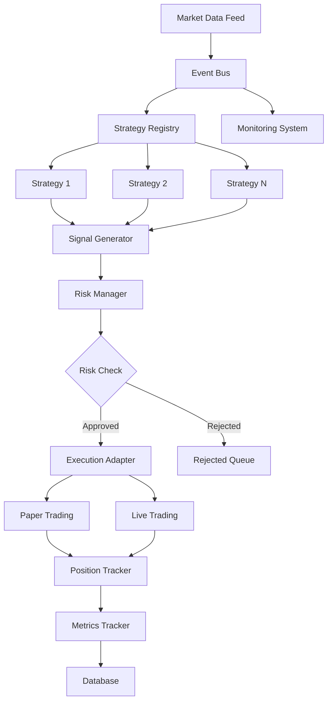
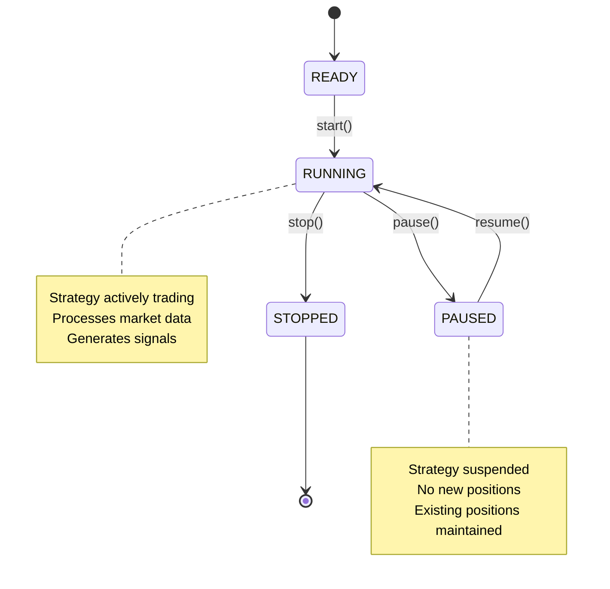
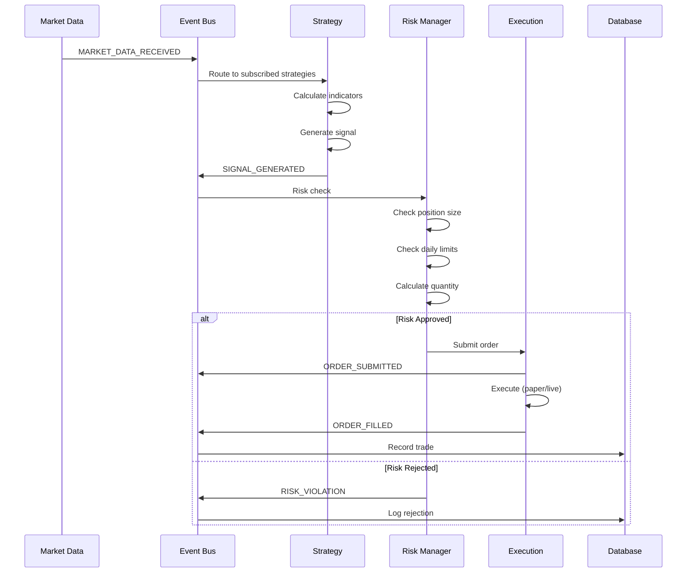

# TWS Robot Architecture Overview

## System Purpose

TWS Robot is a quantitative trading platform designed to execute algorithmic trading strategies through Interactive Brokers' Trader Workstation (TWS). The system provides a robust, event-driven architecture that supports multiple concurrent strategies with comprehensive risk management and lifecycle controls.

## Core Design Principles

1. **Event-Driven Architecture** - All components communicate through a central event bus, enabling loose coupling and high testability
2. **Prime Directive Compliance** - 100% test pass rate with zero warnings at all times
3. **Risk-First Design** - Risk management is not optional; every trade passes through risk controls
4. **State Management** - Explicit strategy lifecycle states prevent undefined behavior
5. **Paper-First Validation** - Strategies must prove themselves in paper trading before live deployment

## High-Level Architecture



## Core Components

### 1. Event Bus (`core/event_bus.py`)

**Purpose:** Central nervous system for all component communication

**Key Features:**
- Publish/subscribe pattern
- Type-safe event routing
- Event statistics tracking
- Zero-copy event delivery

**Critical Events:**
- `MARKET_DATA_RECEIVED` - Real-time market data arrives
- `SIGNAL_GENERATED` - Strategy generates trading signal
- `ORDER_SUBMITTED` - Order sent to broker
- `ORDER_FILLED` - Order execution confirmed
- `RISK_VIOLATION` - Risk limit breached

### 2. Strategy Lifecycle Manager (`strategy/lifecycle.py`)

**Purpose:** Manages strategy state transitions and validation

**State Machine:**


**Validation Gates:**
- Minimum trades threshold (30+)
- Minimum runtime (30 days)
- Sharpe ratio > 1.5
- Max drawdown < 15%
- Win rate > 50%

### 3. Strategy Registry (`strategies/strategy_registry.py`)

**Purpose:** Multi-strategy coordination and management

**Responsibilities:**
- Strategy class registration
- Strategy instance creation
- Bulk lifecycle operations (start_all, stop_all)
- Symbol-based strategy filtering
- Performance aggregation

**Key Methods:**
```python
registry.register_strategy_class("BollingerBands", BollingerBandsStrategy)
strategy = registry.create_strategy("BollingerBands", config)
registry.start_all()
running_strategies = registry.get_strategies_by_state(StrategyState.RUNNING)
```

### 4. Risk Manager (`risk/risk_manager.py`)

**Purpose:** Enforce risk limits and position sizing

**Controls:**
- Per-position size limits (5% max)
- Portfolio-wide risk limits (10% max)
- Daily loss limits (2% max)
- Sector concentration limits (25% max)
- Correlation limits (0.7 max)
- Leverage limits

**Position Sizing:**
- Kelly Criterion with fractional sizing
- Account-based sizing
- Risk-adjusted quantities
- Stop-loss integration

### 5. Execution Adapters

#### Paper Trading Adapter (`execution/paper_adapter.py`)
- Simulated order execution
- Realistic fill prices
- Position tracking
- P&L calculation
- No broker required

#### Live Trading Adapter (`execution/live_adapter.py`)
- TWS API integration
- Real order submission
- Fill confirmation
- Account synchronization

### 6. Data Layer

#### Models (`data/models.py`)
- SQLAlchemy ORM models
- Trade history
- Position snapshots
- Strategy configurations
- Performance metrics

#### Database (`data/database.py`)
- SQLite for local development
- PostgreSQL for production
- Connection pooling
- Session management
- Migration support

### 7. Monitoring System (`monitoring/`)

**Components:**
- Real-time metrics tracking
- Performance analytics
- Validation monitoring
- Alert generation
- Dashboard integration

## Data Flow

### Market Data → Trading Signal → Order Execution



## Technology Stack

**Core:**
- Python 3.12+
- asyncio for concurrency
- SQLAlchemy for ORM
- pytest for testing

**External APIs:**
- Interactive Brokers TWS API
- Market data feeds

**Data Science:**
- pandas for data manipulation
- numpy for numerical computation
- matplotlib for visualization (optional)

## Deployment Modes

### 1. Backtest Mode
- Historical data simulation
- Strategy parameter optimization
- Performance validation
- No broker connection required

### 2. Paper Trading Mode
- Real-time data
- Simulated execution
- Full system integration
- Risk validation

### 3. Live Trading Mode
- Real-time data
- Real order execution
- Real money at risk
- Requires validation gate passage

## Key Design Decisions

See [Architecture Decision Records](../decisions/) for detailed rationale:
- [ADR-001: Event Bus Architecture](../decisions/001-event-bus-architecture.md)
- [ADR-002: Paper Trading Approach](../decisions/002-paper-trading-approach.md)
- [ADR-003: Risk Parameter Choices](../decisions/003-risk-parameter-choices.md)
- [ADR-004: State Machine Design](../decisions/004-state-machine-design.md)

## Testing Strategy

- **690+ unit tests** covering all critical paths
- **44% overall coverage**, 95%+ in risk/execution modules
- **Prime Directive:** 100% pass rate, zero warnings
- Mock-based testing for external dependencies
- Integration tests for end-to-end workflows

See [Testing Guide](../TESTING.md) for details.

## Security Considerations

1. **API Keys:** Never committed to repository, use environment variables
2. **Database:** Encrypted at rest for production
3. **Logging:** Sensitive data (prices, quantities) sanitized in production logs
4. **Network:** All broker communications over secure channels

## Performance Characteristics

- **Event throughput:** 10,000+ events/second
- **Strategy latency:** < 10ms from market data to signal
- **Risk check latency:** < 5ms per order
- **Database writes:** Async, non-blocking
- **Memory footprint:** ~200MB for 10 active strategies

## Scalability

**Current System:**
- Up to 50 concurrent strategies
- Up to 100 symbols
- Single-machine deployment

**Future Expansion:**
- Distributed event bus (Redis/Kafka)
- Microservices architecture
- Cloud deployment (AWS/Azure)
- Real-time analytics pipeline

## Monitoring & Observability

**Metrics Tracked:**
- Strategy performance (Sharpe, drawdown, P&L)
- System health (CPU, memory, latency)
- Risk utilization (position size, daily loss)
- Trade statistics (win rate, profit factor)

**Alerting:**
- Risk limit breaches
- Strategy failures
- Connection issues
- Performance degradation

## Next Steps

- [Understanding Risk Controls](risk-controls.md)
- [Event Flow Details](event-flow.md)
- [Strategy Lifecycle Deep Dive](strategy-lifecycle.md)
- [Adding a New Strategy](../runbooks/adding-new-strategy.md)
