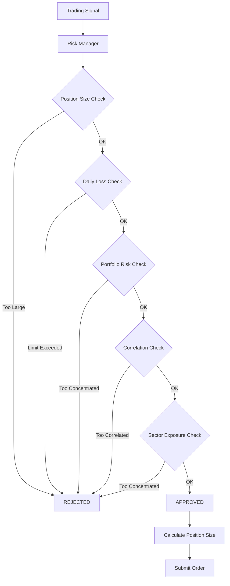

# Risk Management & Controls

## Overview

Risk management is the **most critical component** of the TWS Robot system. Every trade, every position, and every dollar at risk passes through multiple layers of controls. This is not optional - it is enforced at the architectural level.

> **Philosophy:** Preserve capital first, make profits second. A single catastrophic loss can wipe out months of gains.

## Risk Control Architecture



## Risk Profiles

Three predefined risk profiles control all risk parameters:

### Conservative Profile (Default)
```python
RiskProfile.CONSERVATIVE
├── Max Position Size: 5% of account
├── Max Portfolio Risk: 10% of account
├── Max Daily Loss: 2% of account
├── Max Drawdown: 15%
├── Max Sector Exposure: 25%
├── Max Correlation: 0.7
└── Leverage: 1.0x (no leverage)
```

**Use Case:** Primary capital preservation, steady growth, can't afford major losses

### Moderate Profile
```python
RiskProfile.MODERATE
├── Max Position Size: 10% of account
├── Max Portfolio Risk: 15% of account
├── Max Daily Loss: 3% of account
├── Max Drawdown: 20%
├── Max Sector Exposure: 35%
├── Max Correlation: 0.8
└── Leverage: 1.5x
```

**Use Case:** Balanced approach, willing to take calculated risks

### Aggressive Profile
```python
RiskProfile.AGGRESSIVE
├── Max Position Size: 15% of account
├── Max Portfolio Risk: 25% of account
├── Max Daily Loss: 5% of account
├── Max Drawdown: 30%
├── Max Sector Exposure: 50%
├── Max Correlation: 0.85
└── Leverage: 2.0x
```

**Use Case:** Growth-focused, higher risk tolerance, experienced traders only

## Position Sizing Algorithm

### Kelly Criterion with Fractional Sizing

```python
def calculate_position_size(self, symbol, account_equity, entry_price, stop_loss):
    """
    Calculate optimal position size using Kelly Criterion
    """
    # Calculate risk per share
    risk_per_share = abs(entry_price - stop_loss)
    
    # Maximum dollars at risk per trade
    max_risk_dollars = account_equity * self.profile.max_position_size_pct
    
    # Calculate raw position size
    raw_position_size = max_risk_dollars / risk_per_share
    
    # Apply fractional Kelly (0.5x for safety)
    position_size = int(raw_position_size * 0.5)
    
    # Enforce maximum position value
    max_position_value = account_equity * self.profile.max_position_size_pct
    max_shares = int(max_position_value / entry_price)
    
    return min(position_size, max_shares)
```

### Why Fractional Kelly?

Full Kelly Criterion maximizes growth but leads to large drawdowns. We use **half Kelly** (50% of Kelly-optimal size) which:
- Reduces drawdown by ~50%
- Reduces growth rate by only ~25%
- Provides better risk-adjusted returns
- More psychologically sustainable

## Risk Checks (In Order)

### 1. Account-Level Checks

**Daily Loss Limit**
```python
if daily_loss >= (account_equity * profile.max_daily_loss_pct):
    # HALT ALL TRADING FOR THE DAY
    # No new positions, existing positions maintained
    # Automatic resume next trading day
    raise DailyLossLimitExceeded()
```

**Portfolio Drawdown Limit**
```python
current_drawdown = (peak_equity - current_equity) / peak_equity

if current_drawdown >= profile.max_drawdown_pct:
    # EMERGENCY SHUTDOWN
    # Close all positions
    # Notify administrator
    # Manual intervention required
    raise MaxDrawdownExceeded()
```

### 2. Position-Level Checks

**Position Size Limit**
```python
position_value = quantity * entry_price

if position_value > (account_equity * profile.max_position_size_pct):
    # Reduce position size to maximum allowed
    quantity = int((account_equity * profile.max_position_size_pct) / entry_price)
```

**Symbol Diversification**
```python
# Prevent over-concentration in single symbol
if symbol in existing_positions:
    current_exposure = existing_positions[symbol].value
    new_exposure = current_exposure + (quantity * entry_price)
    
    if new_exposure > (account_equity * profile.max_position_size_pct):
        # Reject or reduce to stay within limit
        available_capital = (account_equity * profile.max_position_size_pct) - current_exposure
        quantity = int(available_capital / entry_price)
```

### 3. Portfolio-Level Checks

**Total Risk Utilization**
```python
# Sum of all position risks
total_risk = sum(pos.quantity * abs(pos.entry_price - pos.stop_loss) 
                 for pos in all_positions)

if total_risk > (account_equity * profile.max_portfolio_risk_pct):
    # Reject new position - portfolio too risky
    raise PortfolioRiskLimitExceeded()
```

**Sector Concentration**
```python
# Prevent over-concentration in single sector
sector = get_sector(symbol)
sector_exposure = sum(pos.value for pos in all_positions 
                      if pos.sector == sector)

if sector_exposure > (account_equity * profile.max_sector_exposure_pct):
    # Reject - too much exposure to this sector
    raise SectorConcentrationExceeded()
```

### 4. Correlation Checks

**Portfolio Correlation**
```python
# Prevent adding highly correlated positions
for existing_pos in all_positions:
    correlation = calculate_correlation(symbol, existing_pos.symbol, lookback=60)
    
    if correlation > profile.max_correlation:
        # Positions move too similarly - reject for diversification
        raise HighCorrelationRejected()
```

## Emergency Controls

### Circuit Breakers

**Rapid Loss Circuit Breaker**
```python
# If portfolio loses X% in Y minutes, halt trading
if (portfolio_loss / time_window) > RAPID_LOSS_THRESHOLD:
    emergency_halt()
    close_all_positions()
    notify_admin("Circuit breaker triggered")
```

**Strategy-Level Circuit Breaker**
```python
# If single strategy shows anomalous behavior
if strategy.consecutive_losses > 5:
    strategy.pause()
    notify_admin(f"Strategy {strategy.name} paused - 5 consecutive losses")
```

### Manual Override Controls

**Emergency Shutdown**
```python
# Accessible via CLI or API
def emergency_shutdown():
    """Full system shutdown - close all positions, stop all strategies"""
    for strategy in registry.get_all_strategies():
        strategy.stop()
    
    for position in portfolio.get_all_positions():
        close_position(position, reason="EMERGENCY_SHUTDOWN")
    
    halt_all_trading()
    log_emergency_shutdown()
```

**Risk Parameter Override**
```python
# Temporary risk parameter changes (requires admin approval)
risk_manager.set_temporary_limit(
    parameter="max_position_size_pct",
    value=0.03,  # Reduce from 5% to 3%
    duration_hours=24,
    reason="High market volatility"
)
```

## Risk Monitoring

### Real-Time Metrics

**Dashboard Metrics:**
- Current portfolio value
- Daily P&L ($ and %)
- Drawdown from peak
- Risk utilization (% of max)
- Open positions count
- Sector exposures
- Correlation matrix

**Alert Triggers:**
- Daily loss > 75% of limit
- Drawdown > 75% of limit
- Single position loss > 10%
- Strategy consecutive losses > 3
- Unusual trading volume

### Historical Analysis

**Weekly Risk Report:**
- Largest drawdown period
- Maximum daily loss
- Average position size
- Risk-adjusted returns (Sharpe ratio)
- Correlation breakdown
- Sector exposure trends

## Testing Risk Controls

### Unit Tests

All risk controls have dedicated test coverage:
```bash
pytest tests/test_risk_manager.py -v
pytest tests/test_position_sizer.py -v
pytest tests/test_emergency_controls.py -v
pytest tests/test_drawdown_control.py -v
```

**Coverage:** 99% for risk management modules

### Stress Testing

**Scenario Testing:**
```python
# Test extreme market conditions
scenarios = [
    "black_monday_1987",      # -22% market crash
    "flash_crash_2010",        # Rapid intraday collapse
    "march_2020_covid",        # Extended volatility
    "gme_short_squeeze_2021"   # Extreme single-stock movement
]

for scenario in scenarios:
    result = backtest_with_scenario(scenario)
    assert result.max_drawdown < profile.max_drawdown_pct
    assert result.largest_loss < profile.max_daily_loss_pct
```

## Configuration

### Setting Risk Profile

**In Code:**
```python
from risk.risk_profiles import RiskProfile

risk_manager = RealTimeRiskMonitor(
    initial_capital=100000,
    profile=RiskProfile.CONSERVATIVE
)
```

**In Config File:**
```yaml
risk:
  profile: conservative
  overrides:
    max_position_size_pct: 0.04  # Override default 5% to 4%
    max_daily_loss_pct: 0.015    # Override default 2% to 1.5%
```

### Custom Risk Profile

```python
custom_profile = RiskProfileConfig(
    name="Ultra Conservative",
    max_position_size_pct=0.02,      # 2% max
    max_portfolio_risk_pct=0.05,     # 5% max
    max_daily_loss_pct=0.01,         # 1% max
    max_drawdown_pct=0.10,           # 10% max
    max_sector_exposure_pct=0.15,    # 15% max
    max_correlation=0.6,
    max_leverage=1.0
)

risk_manager = RealTimeRiskMonitor(
    initial_capital=100000,
    profile=custom_profile
)
```

## Best Practices

### 1. Start Conservative
Always begin with `CONSERVATIVE` profile until you understand system behavior.

### 2. Never Disable Risk Checks
```python
# ❌ NEVER DO THIS
risk_manager.disable_checks = True  # This doesn't even exist!

# ✅ If you need more risk, use appropriate profile
risk_manager = RealTimeRiskMonitor(profile=RiskProfile.MODERATE)
```

### 3. Monitor Daily
Check risk dashboard every trading day:
- Are limits being hit frequently? (May need adjustment)
- Are limits never hit? (May be too conservative)
- Is drawdown trending upward? (Consider reducing exposure)

### 4. Backtest Risk Parameters
Before changing risk parameters, backtest on historical data to understand impact.

### 5. Document Risk Changes
Use Architecture Decision Records (ADRs) to document any risk parameter changes and rationale.

## Common Scenarios

### Scenario 1: Daily Loss Limit Hit

**What Happens:**
1. System halts all new position entries
2. Existing positions maintained (not force-closed)
3. Alert sent to admin
4. Trading resumes automatically next day

**Action Required:**
- Review trades that caused the loss
- Check if specific strategy underperforming
- Consider strategy pause if repeated pattern

### Scenario 2: Single Large Loss

**What Happens:**
1. Position closed at stop-loss
2. Post-trade analysis logged
3. Strategy continues if within limits

**Action Required:**
- Verify stop-loss was appropriate
- Check if risk sizing was correct
- Review strategy logic if unexpected

### Scenario 3: Maximum Drawdown Approached

**What Happens:**
1. Alert at 75% of max drawdown
2. Emergency shutdown at 100% of max drawdown
3. All positions closed
4. Manual review required to resume

**Action Required:**
- Analyze what caused drawdown
- Review all strategy performance
- Consider reducing risk profile
- Possibly pause underperforming strategies

## Risk-Adjusted Performance Metrics

### Sharpe Ratio
```
Sharpe = (Portfolio Return - Risk Free Rate) / Portfolio Volatility
Target: > 1.5
```

### Sortino Ratio
```
Sortino = (Portfolio Return - Risk Free Rate) / Downside Deviation
Target: > 2.0
```

### Maximum Drawdown
```
Max Drawdown = (Peak Portfolio Value - Trough Value) / Peak Value
Conservative Target: < 15%
```

### Profit Factor
```
Profit Factor = Gross Profits / Gross Losses
Target: > 1.5
```

## Further Reading

- [Position Sizing Deep Dive](../decisions/003-risk-parameter-choices.md)
- [Emergency Procedures Runbook](../runbooks/emergency-procedures.md)
- [Drawdown Analysis](../architecture/drawdown-analysis.md)
- [Backtesting Risk Scenarios](../runbooks/backtest-risk-scenarios.md)

---

**Remember:** The goal is not to eliminate risk (impossible in trading) but to control and understand it. Every dollar at risk should be intentional and within defined limits.
