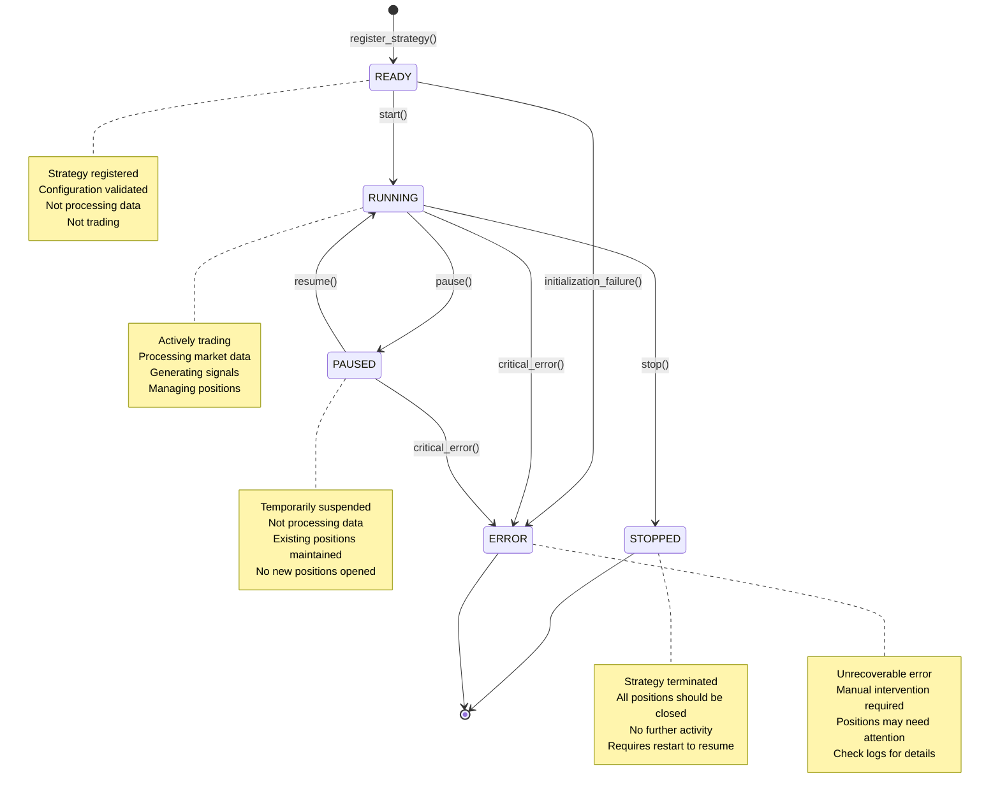

# Strategy Lifecycle Management

## Overview

Every trading strategy in TWS Robot goes through a well-defined lifecycle with explicit state transitions. This prevents undefined behavior and ensures strategies are only trading when they're supposed to be.

> **Key Principle:** A strategy's state is always known and controlled. No surprise trading.

## State Machine



## State Descriptions

### READY State

**When:** Strategy has been registered but not started  
**Characteristics:**
- Configuration validated
- Resources allocated
- Event subscriptions prepared
- Not consuming market data
- Not generating signals

**Valid Transitions:** → RUNNING, → ERROR

**Example:**
```python
strategy = BollingerBandsStrategy(
    name="BB_AAPL",
    symbols=["AAPL"]
)
assert strategy.state == StrategyState.READY
```

### RUNNING State

**When:** Strategy is actively trading  
**Characteristics:**
- Consuming market data
- Calculating indicators
- Generating signals
- Managing positions
- Responding to fills

**Valid Transitions:** → PAUSED, → STOPPED, → ERROR

**Example:**
```python
strategy.start()
assert strategy.state == StrategyState.RUNNING
assert strategy.start_time is not None
```

**Actions Performed:**
1. Subscribe to market data events
2. Initialize indicator buffers
3. Load existing positions (if any)
4. Publish `STRATEGY_STARTED` event
5. Begin processing market data

### PAUSED State

**When:** Strategy temporarily suspended  
**Characteristics:**
- Not consuming new market data
- Not generating new signals
- Existing positions maintained
- Can be resumed without restart

**Valid Transitions:** → RUNNING, → STOPPED, → ERROR

**Use Cases:**
- High market volatility
- News events pending
- Strategy debugging
- Risk limit adjustments

**Example:**
```python
strategy.pause()
assert strategy.state == StrategyState.PAUSED

# Existing positions still tracked
assert len(strategy.positions) > 0

# Resume when conditions improve
strategy.resume()
assert strategy.state == StrategyState.RUNNING
```

### STOPPED State

**When:** Strategy permanently terminated  
**Characteristics:**
- All event subscriptions removed
- No market data processing
- Positions should be closed
- Cannot resume without restart

**Valid Transitions:** → None (terminal state)

**Example:**
```python
strategy.stop()
assert strategy.state == StrategyState.STOPPED
assert strategy.stop_time is not None

# Clean shutdown
assert len(strategy.positions) == 0
```

### ERROR State

**When:** Unrecoverable error occurred  
**Characteristics:**
- Strategy cannot continue
- Manual intervention required
- Positions may need attention
- Error details logged

**Valid Transitions:** → None (terminal state)

**Common Errors:**
- Connection loss to broker
- Invalid configuration detected
- Critical calculation error
- Resource exhaustion

**Example:**
```python
try:
    strategy.process_bar(invalid_data)
except CriticalError:
    assert strategy.state == StrategyState.ERROR
    # Check logs, fix issue, restart strategy
```

## Lifecycle Operations

### Registration

```python
from strategy.lifecycle import StrategyLifecycle

lifecycle = StrategyLifecycle(event_bus)

# Register strategy with metadata
strategy_id = lifecycle.register_strategy(
    strategy_name="BollingerBands_AAPL",
    symbols=["AAPL"],
    parameters={
        'period': 20,
        'std_dev': 2.0
    }
)

# Query state
state = lifecycle.get_state(strategy_id)
assert state == StrategyState.READY
```

### Starting a Strategy

```python
# Start single strategy
lifecycle.start_strategy(strategy_id)

# Or start directly on strategy instance
strategy.start()

# Verify running
assert lifecycle.get_state(strategy_id) == StrategyState.RUNNING

# Events published:
# - STRATEGY_STARTED event
# - Subscriptions to MARKET_DATA_RECEIVED
```

### Pausing a Strategy

```python
# Pause for temporary suspension
lifecycle.pause_strategy(strategy_id)

# What happens:
# 1. Market data subscriptions suspended
# 2. Signal generation halted
# 3. Existing positions maintained
# 4. STRATEGY_PAUSED event published

# Use cases:
# - Market conditions unfavorable
# - Strategy parameter adjustment
# - Temporary risk reduction
```

### Resuming a Strategy

```python
# Resume from paused state
lifecycle.resume_strategy(strategy_id)

# What happens:
# 1. Market data subscriptions restored
# 2. Signal generation resumed
# 3. Position management continues
# 4. STRATEGY_RESUMED event published
```

### Stopping a Strategy

```python
# Clean shutdown
lifecycle.stop_strategy(strategy_id)

# What happens:
# 1. Market data subscriptions removed
# 2. Signal generation stopped
# 3. Positions closed (if auto_close=True)
# 4. STRATEGY_STOPPED event published
# 5. Final metrics calculated
# 6. State persisted to database
```

## Bulk Operations

### Registry-Level Control

```python
from strategies.strategy_registry import StrategyRegistry

registry = StrategyRegistry(event_bus)

# Start all registered strategies
registry.start_all()

# Stop all strategies
registry.stop_all()

# Pause all strategies (emergency)
registry.pause_all()

# Resume all paused strategies
registry.resume_all()

# Filter operations
running = registry.get_strategies_by_state(StrategyState.RUNNING)
registry.stop_strategies(running)
```

## State Transitions & Validations

### Validation Before Live Trading

Before a strategy can trade live (not paper), it must pass validation:

```python
from strategy.lifecycle import ValidationCriteria

criteria = ValidationCriteria(
    min_trades=30,
    min_days_running=30,
    min_sharpe_ratio=1.5,
    max_drawdown=0.15,
    min_win_rate=0.50
)

# Update strategy metrics
metrics = StrategyMetrics(
    sharpe_ratio=2.1,
    max_drawdown=0.085,
    win_rate=0.62,
    total_trades=45,
    days_running=35
)

lifecycle.update_metrics(strategy_id, metrics)

# Validate for promotion
can_go_live = criteria.validate(metrics)

if can_go_live:
    lifecycle.promote_to_live(strategy_id)
else:
    print("Strategy not ready for live trading")
    print(criteria.get_validation_report(metrics))
```

### Validation Report Example

```
Strategy Validation Report
==========================
Strategy: BollingerBands_AAPL

✅ Trades: 45 (min: 30)
✅ Runtime: 35 days (min: 30)
✅ Sharpe Ratio: 2.1 (min: 1.5)
✅ Max Drawdown: 8.5% (max: 15%)
✅ Win Rate: 62% (min: 50%)
✅ Profit Factor: 1.8 (min: 1.3)

Overall: PASSED - Ready for live trading
```

## Metrics Tracking

### Performance Metrics

```python
class StrategyMetrics:
    # Risk-adjusted returns
    sharpe_ratio: float
    sortino_ratio: float
    
    # Drawdown analysis
    max_drawdown: float
    current_drawdown: float
    avg_drawdown: float
    
    # Trade statistics
    total_trades: int
    winning_trades: int
    losing_trades: int
    win_rate: float
    
    # P&L metrics
    total_pnl: float
    avg_win: float
    avg_loss: float
    profit_factor: float
    
    # Time-based
    days_running: int
    avg_trade_duration: timedelta
    
    # Consistency
    consecutive_losses: int
    max_consecutive_losses: int
```

### Updating Metrics

```python
# Automatic update on each trade
@strategy.on_trade_closed
def update_metrics(trade):
    metrics = calculate_metrics(strategy.trades)
    lifecycle.update_metrics(strategy.strategy_id, metrics)
    
    # Publish metrics update
    event_bus.publish(Event(
        EventType.METRICS_UPDATED,
        {
            'strategy_id': strategy.strategy_id,
            'metrics': metrics.to_dict()
        }
    ))
```

## Database Persistence

### State Persistence

All state transitions are persisted:

```sql
CREATE TABLE strategy_state (
    strategy_name TEXT PRIMARY KEY,
    current_state TEXT NOT NULL,
    previous_state TEXT,
    updated_at TEXT NOT NULL,
    created_at TEXT NOT NULL,
    metrics_json TEXT,
    notes TEXT
);

CREATE TABLE state_transitions (
    id INTEGER PRIMARY KEY AUTOINCREMENT,
    strategy_name TEXT NOT NULL,
    from_state TEXT NOT NULL,
    to_state TEXT NOT NULL,
    timestamp TEXT NOT NULL,
    reason TEXT,
    approved_by TEXT
);
```

### Running-State Persistence (Restart Recovery)

The `strategy_instances` table stores a `running_state` column so that each
strategy's active state (RUNNING / PAUSED / STOPPED / READY) survives
application restarts:

```sql
CREATE TABLE strategy_instances (
    name              TEXT NOT NULL,
    account_id        TEXT NOT NULL DEFAULT '',
    strategy_type     TEXT NOT NULL,
    symbols_json      TEXT NOT NULL,
    parameters_json   TEXT NOT NULL,
    created_at        TEXT NOT NULL,
    running_state     TEXT NOT NULL DEFAULT 'READY',
    PRIMARY KEY (name, account_id)
);
```

Every call to `start_strategy()`, `stop_strategy()`, `pause_strategy()`, or
`resume_strategy()` immediately writes the new state back to this column via
`StrategyLifecycle.update_instance_running_state()`.

**Restart behaviour**

| Persisted `running_state` | State after `load_persisted_strategies()` |
|---|---|
| `RUNNING` | Strategy is started automatically (`RUNNING`) |
| `PAUSED` | Strategy is started then paused (`PAUSED`) |
| `STOPPED` | Strategy is loaded as `READY` (not auto-restarted) |
| `READY` | Strategy is loaded as `READY` |

### Querying State History

```python
# Get current state
current = lifecycle.get_state(strategy_id)

# Get state history
history = lifecycle.get_state_history(strategy_id)

for transition in history:
    print(f"{transition.timestamp}: {transition.from_state} → {transition.to_state}")
    print(f"  Reason: {transition.reason}")

# Example output:
# 2026-01-15 09:30:00: READY → RUNNING
#   Reason: Manual start
# 2026-01-18 14:15:00: RUNNING → PAUSED
#   Reason: High volatility detected
# 2026-01-18 15:45:00: PAUSED → RUNNING
#   Reason: Volatility normalized
```

## Event Notifications

### Lifecycle Events Published

```python
# On strategy start
STRATEGY_STARTED = {
    'strategy_id': str,
    'strategy_name': str,
    'symbols': List[str],
    'parameters': dict,
    'timestamp': datetime
}

# On strategy stop
STRATEGY_STOPPED = {
    'strategy_id': str,
    'reason': str,
    'final_pnl': float,
    'total_trades': int,
    'win_rate': float,
    'timestamp': datetime
}

# On strategy pause
STRATEGY_PAUSED = {
    'strategy_id': str,
    'reason': str,
    'open_positions': int,
    'timestamp': datetime
}

# On state transition
STATE_TRANSITION = {
    'strategy_id': str,
    'from_state': str,
    'to_state': str,
    'reason': str,
    'timestamp': datetime
}
```

## Error Handling

### Graceful Degradation

```python
class BollingerBandsStrategy(BaseStrategy):
    def on_bar(self, symbol, bar_data):
        try:
            # Process bar data
            self.calculate_indicators(bar_data)
            self.check_signals(bar_data)
        except DataError as e:
            # Recoverable error - log and continue
            logger.warning(f"Data error: {e}")
            self.error_count += 1
            if self.error_count > 10:
                # Too many errors - transition to ERROR state
                self.transition_to_error(str(e))
        except CriticalError as e:
            # Unrecoverable - immediate ERROR state
            logger.error(f"Critical error: {e}")
            self.transition_to_error(str(e))
            self.emergency_close_positions()
```

### Recovery Procedures

```python
# Check strategies in error state
error_strategies = lifecycle.get_strategies_by_state(StrategyState.ERROR)

for strategy_id in error_strategies:
    # Review error logs
    error_info = lifecycle.get_error_info(strategy_id)
    print(f"Strategy {strategy_id} error: {error_info}")
    
    # If fixable, remove and re-register
    if is_fixable(error_info):
        lifecycle.remove_strategy(strategy_id)
        # Fix configuration
        lifecycle.register_strategy(...)  # With corrected config
```

## Best Practices

### 1. Always Check State Before Operations

```python
# ❌ Bad
strategy.process_bar(bar_data)  # May not be running!

# ✅ Good
if strategy.state == StrategyState.RUNNING:
    strategy.process_bar(bar_data)
```

### 2. Use Pause Instead of Stop for Temporary Halts

```python
# ❌ Bad - Loses state, requires full restart
strategy.stop()
# ... later ...
strategy = recreate_strategy()
strategy.start()

# ✅ Good - Maintains state
strategy.pause()
# ... later ...
strategy.resume()
```

### 3. Close Positions Before Stop

```python
# ✅ Good
strategy.close_all_positions()
await asyncio.sleep(5)  # Wait for closes to complete
strategy.stop()
```

### 4. Monitor State Transitions

```python
# Subscribe to state changes
event_bus.subscribe(EventType.STATE_TRANSITION, lambda e: {
    logger.info(f"Strategy {e.data['strategy_id']}: "
                f"{e.data['from_state']} → {e.data['to_state']}")
})
```

### 5. Validate Before Starting

```python
# ✅ Good
config = StrategyConfig(...)
validator = StrategyValidator()

if validator.validate_config(config):
    strategy = BollingerBandsStrategy(config)
    strategy.start()
else:
    print("Invalid configuration:", validator.get_errors())
```

## Testing Strategy Lifecycle

```python
def test_strategy_lifecycle():
    """Test complete lifecycle"""
    strategy = BollingerBandsStrategy(config)
    
    # Initial state
    assert strategy.state == StrategyState.READY
    
    # Start
    strategy.start()
    assert strategy.state == StrategyState.RUNNING
    assert strategy.start_time is not None
    
    # Pause
    strategy.pause()
    assert strategy.state == StrategyState.PAUSED
    
    # Resume
    strategy.resume()
    assert strategy.state == StrategyState.RUNNING
    
    # Stop
    strategy.stop()
    assert strategy.state == StrategyState.STOPPED
    assert strategy.stop_time is not None
```

## Further Reading

- [Strategy Registry](../architecture/overview.md#strategy-registry)
- [Event Flow](event-flow.md)
- [Adding a New Strategy](../runbooks/adding-new-strategy.md)
- [Debugging Strategy Issues](../runbooks/debugging-strategies.md)
